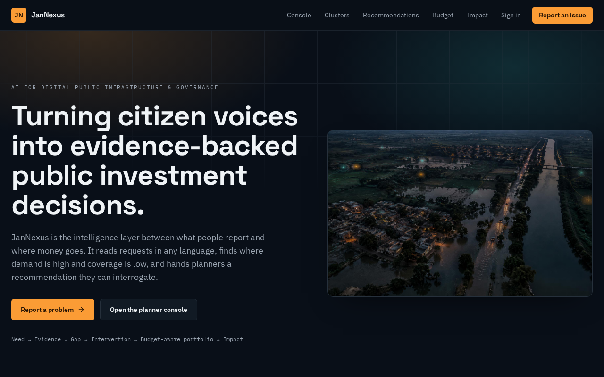
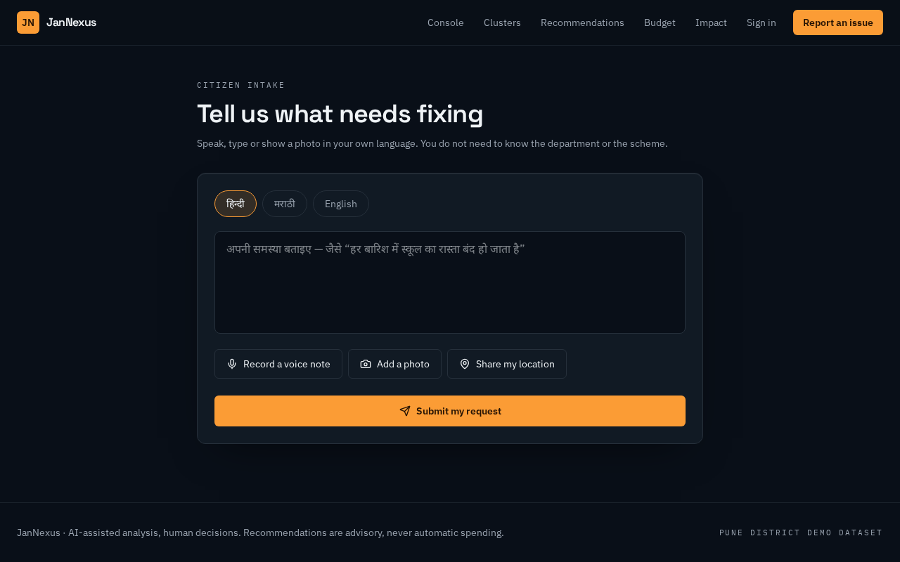
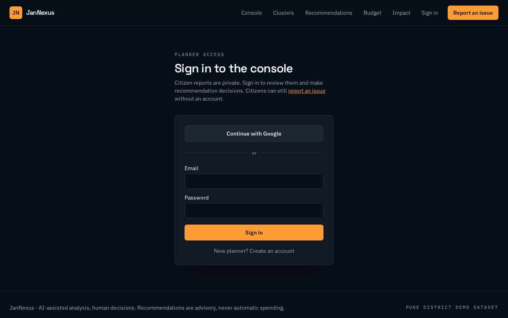
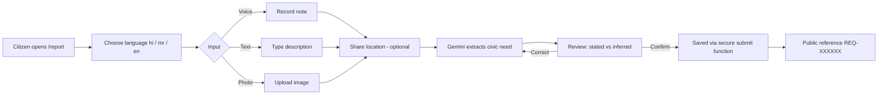
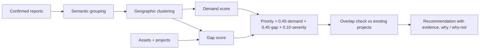
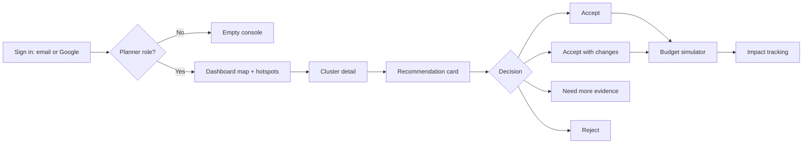
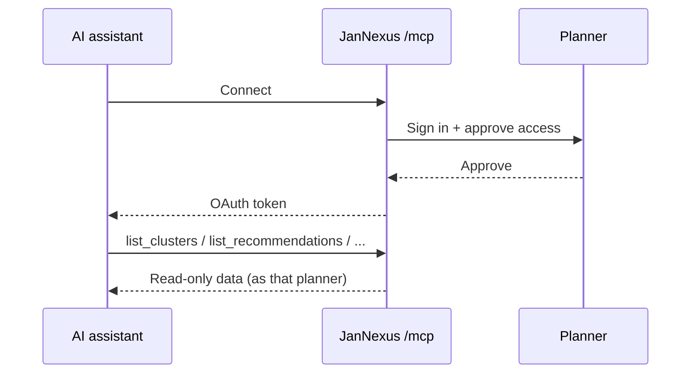

# JanNexus

**Turning citizen voices into evidence-backed public investment decisions.**

JanNexus is a multilingual, multimodal AI platform for *AI for Digital Public Infrastructure & Governance*. Citizens report local problems by voice, text or photo in Hindi, Marathi or English. JanNexus turns these reports into structured, map-based infrastructure needs. It groups them into demand clusters, compares them with the assets and projects already in place, and gives planners recommendations they can check and question, each with its evidence.

Live demo: https://magic-pixel-perfect-13.lovable.app



---

## Features

| Area | What it does |
| --- | --- |
| Citizen intake | Pick a language, then report by voice note, text or photo. Add a location from the browser. The citizen reviews "what you said" and "what we inferred" side by side and confirms. They get a public reference number. |
| AI extraction | Gemini reads each report and returns category, infrastructure type, problem, severity, recurrence and location. Stated facts are kept separate from inferences. It never invents a location. |
| Demand clusters | Reports are grouped by meaning and by place, then scored for demand, coverage gap and severity. |
| Planner console | A map of clusters, projects and assets, a hotspot list and the latest signals. |
| Recommendations | Each card explains why this option and why not the others, and flags overlap with existing projects. The officer can accept, modify, investigate or reject it, with a note. |
| Budget simulator | Set a budget and see which items are funded, using either priority order or the most people helped per rupee. It also states clearly what gets left out. |
| Impact tracking | Baseline, current and target values for live projects. Pending items are labelled "Projected". |
| AI assistants (MCP) | Assistants such as Claude or ChatGPT can connect at `/mcp` after planner sign-in (OAuth). They get read-only access. |

## Screenshots

| Citizen report | Planner sign-in |
| --- | --- |
|  |  |

> Console pages (dashboard, clusters, recommendations, budget, impact) require planner sign-in. You can see them on the live demo.

## Flows

### 1. Citizen reporting flow



### 2. Intelligence pipeline



### 3. Planner decision flow



### 4. AI assistant (MCP) flow



## Access and security

- Citizens report without an account. Two secure database functions handle submitting and confirming a report. Neither returns other people's reports.
- Console data and the MCP tools need a signed-in account with the **planner** role, which is stored in a separate roles table.
- Recommendations are advisory only. Nothing is funded automatically.

## Tech stack

- TanStack Start (React 19, Vite 7), Tailwind CSS v4
- Lovable Cloud (Postgres, auth, row-level security)
- Gemini via the Lovable AI Gateway (multimodal extraction)
- Google Maps (map rendering and reverse geocoding)
- Model Context Protocol server (`@lovable.dev/mcp-js`)

## Project structure

```text
src/
  routes/
    index.tsx               Landing
    report.tsx              Citizen intake
    auth.tsx                Sign in / sign up
    _authenticated/         Planner console (dashboard, clusters, recommendations, budget, impact)
  lib/
    analyze.functions.ts    AI extraction + reverse geocoding
    jannexus.functions.ts   Data reads, submissions, decisions
    mcp/                    MCP server + read-only tools
  components/               Header, map (client-only), UI
drizzle/migrations/         Schema, demo data, security policies
docs/screenshots/           README images
```

## Running locally

```sh
bun install
bun run dev   # http://localhost:8080
```

## JanNexus as a Digital Public Good

- **Licence:** intended for release under the MIT licence (code) and CC BY 4.0 (documentation and schemas).
- **Open standards:** locations in WGS84 lat/lng, dates in ISO 8601, language tags in BCP 47, data exchanged as JSON over HTTPS. AI assistants connect through the open Model Context Protocol (MCP) with OAuth 2.1.
- **Privacy and consent:** citizens confirm what the AI understood before anything is saved. Raw reports are readable only by planners. The system keeps stated facts separate from AI inferences.
- **Human decisions:** every accept, modify or reject decision is recorded with a note.
- **Demo data:** Pune district figures are illustrative. Cluster counts are aggregates of historic grievance-portal records plus JanNexus reports.
- **Deploying elsewhere:** a new region needs its boundary data, asset and project registers, language list and currency.
